# Comprehensive Mermaid Diagram Integration: Visual Documentation in Modern Web Applications

In modern web development, visual documentation has become essential for communicating complex architectures, workflows, and relationships. Mermaid diagrams provide a powerful solution for creating professional, interactive visualizations directly within markdown content.

This article showcases a comprehensive implementation of Mermaid diagrams in a Nuxt application, featuring custom GitHub Dark theming, responsive design patterns, and production-ready integration techniques.

## Implementation Overview

Our Mermaid integration supports 15+ diagram types with consistent theming that matches our GitHub Dark design system. Each diagram is rendered with proper error handling, unique ID generation, and responsive scaling.

### Core Architecture

The implementation follows a component-based approach with client-side rendering to prevent hydration issues:

```typescript
// Component architecture pattern
<ClientOnly>
  <MermaidDiagram :code="diagramCode" size="lg" />
</ClientOnly>
```

## Diagram Types Showcase

### 1. Flowchart - System Architecture

Perfect for visualizing application architecture and data flow patterns:

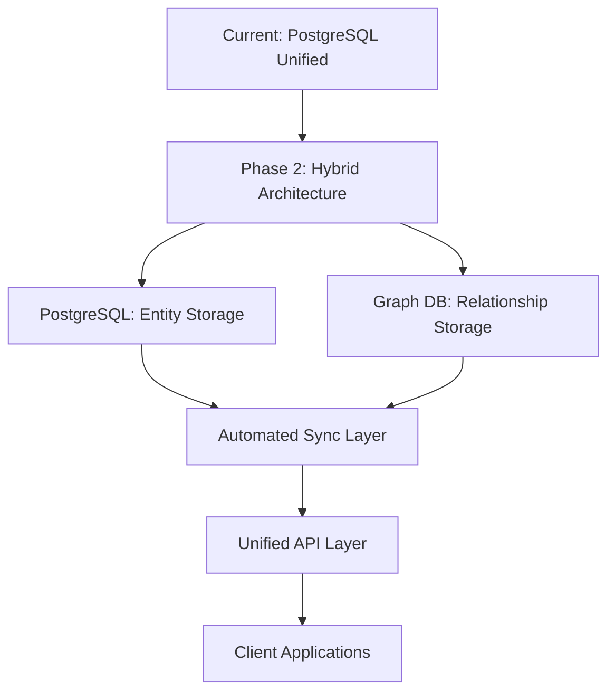
```mermaid
flowchart TD
    A[Current: PostgreSQL Unified] --> B[Phase 2: Hybrid Architecture]
    B --> C[PostgreSQL: Entity Storage]
    B --> D[Graph DB: Relationship Storage]
    C --> E[Automated Sync Layer]
    D --> E
    E --> F[Unified API Layer]
    F --> G[Client Applications]
```

**Use Cases**: System architecture, process flows, decision trees, API workflows

### 2. Sequence Diagram - API Interactions

Ideal for documenting API interactions and temporal relationships:

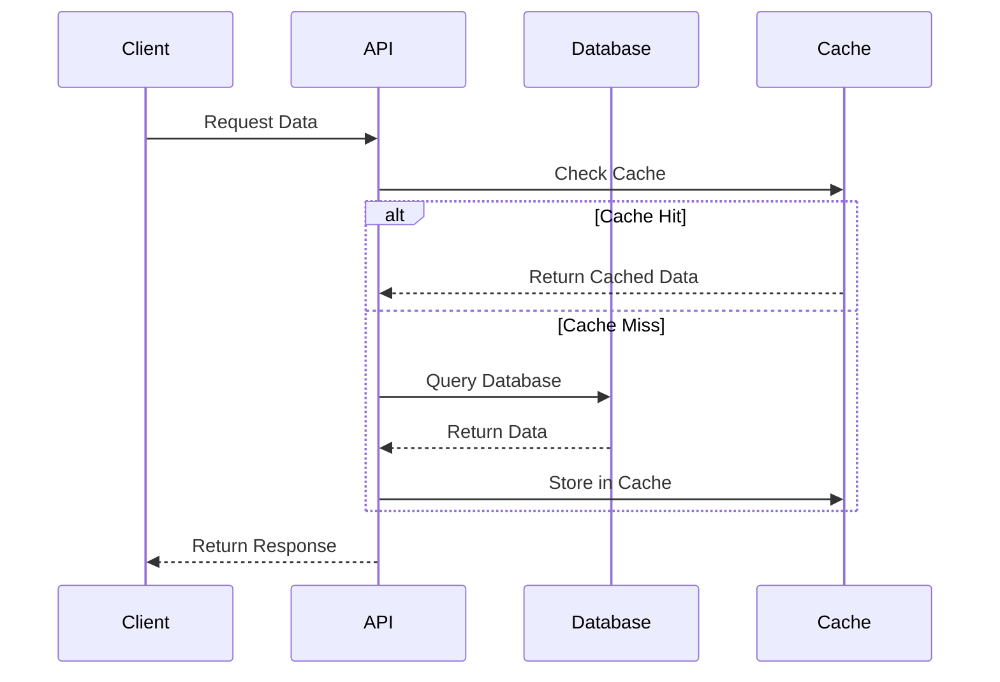
```mermaid
sequenceDiagram
    participant Client
    participant API
    participant Database
    participant Cache
    
    Client->>API: Request Data
    API->>Cache: Check Cache
    alt Cache Hit
        Cache-->>API: Return Cached Data
    else Cache Miss
        API->>Database: Query Database
        Database-->>API: Return Data
        API->>Cache: Store in Cache
    end
    API-->>Client: Return Response
```

**Use Cases**: API documentation, user interactions, microservice communication, authentication flows

### 3. Class Diagram - Object Relationships

Essential for documenting object-oriented designs and data models:

```mermaid
classDiagram
    class User {
        +string id
        +string email
        +string name
        +login()
        +logout()
    }
    
    class Project {
        +string id
        +string title
        +string description
        +create()
        +delete()
    }
    
    User ||--o{ Project : owns
```

**Use Cases**: Database schema design, class hierarchies, component relationships, domain modeling

### 4. State Diagram - Application States

Perfect for modeling state machines and application workflows:

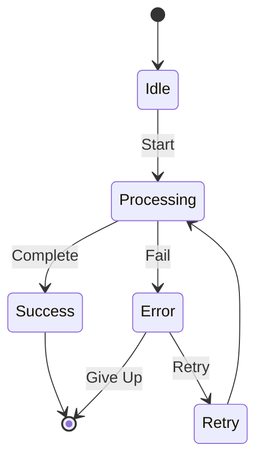
```mermaid
stateDiagram-v2
    [*] --> Idle
    Idle --> Processing : Start
    Processing --> Success : Complete
    Processing --> Error : Fail
    Success --> [*]
    Error --> Retry : Retry
    Retry --> Processing
    Error --> [*] : Give Up
```

**Use Cases**: User authentication states, order processing, form validation, game states

### 5. Entity Relationship Diagram - Database Design

Critical for database schema documentation and relationship modeling:

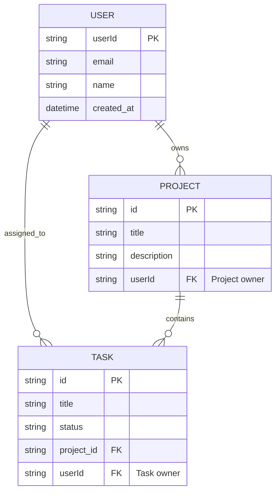
```mermaid
erDiagram
    USER ||--o{ PROJECT : owns
    USER ||--o{ TASK : assigned_to
    USER {
        string userId PK
        string email
        string name
        datetime created_at
    }
    PROJECT ||--o{ TASK : contains
    PROJECT {
        string id PK
        string title
        string description
        string userId FK "Project owner"
    }
    TASK {
        string id PK
        string title
        string status
        string project_id FK
        string userId FK "Task owner"
    }
```

**Use Cases**: Database schema documentation, data modeling, relationship analysis, migration planning

### 6. User Journey - Experience Mapping

Excellent for documenting user experience flows and touchpoints:

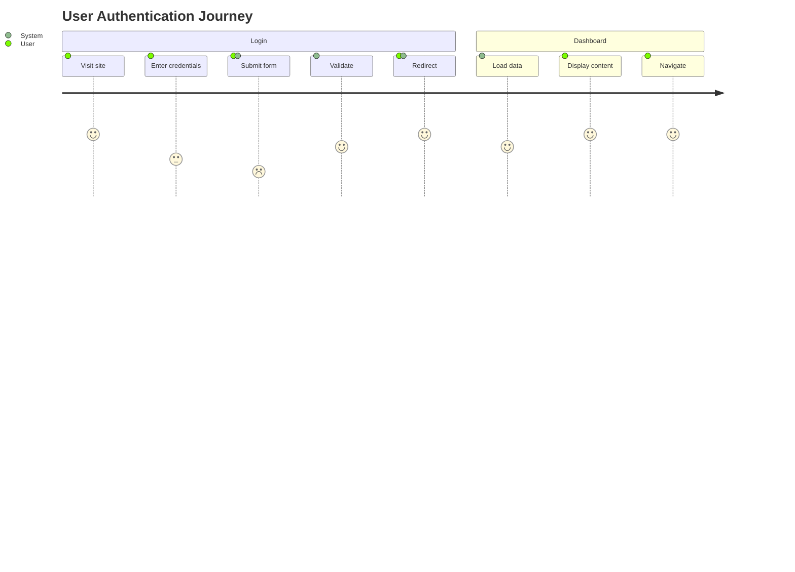
```mermaid
journey
    title User Authentication Journey
    section Login
      Visit site: 5: User
      Enter credentials: 3: User
      Submit form: 2: User, System
      Validate: 4: System
      Redirect: 5: User, System
    section Dashboard
      Load data: 4: System
      Display content: 5: User
      Navigate: 5: User
```

**Use Cases**: User experience design, customer journey mapping, onboarding flows, conversion optimization

### 7. Gantt Chart - Project Timeline

Essential for project management and timeline visualization:

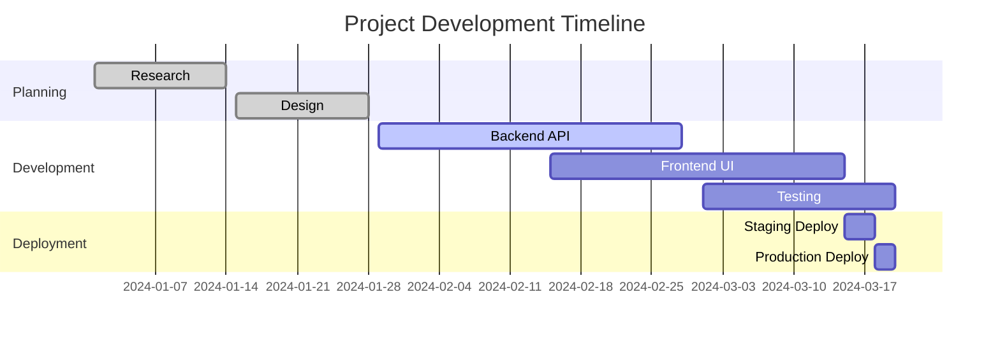
```mermaid
gantt
    title Project Development Timeline
    dateFormat  YYYY-MM-DD
    section Planning
    Research           :done,    des1, 2024-01-01,2024-01-14
    Design             :done,    des2, 2024-01-15,2024-01-28
    section Development
    Backend API        :active,  dev1, 2024-01-29,2024-02-28
    Frontend UI        :         dev2, 2024-02-15,2024-03-15
    Testing            :         test1, 2024-03-01,2024-03-20
    section Deployment
    Staging Deploy     :         deploy1, 2024-03-15,2024-03-18
    Production Deploy  :         deploy2, 2024-03-18,2024-03-20
```

**Use Cases**: Project planning, milestone tracking, resource allocation, sprint planning

### 8. Pie Chart - Data Distribution

Perfect for showing proportional data and resource allocation:

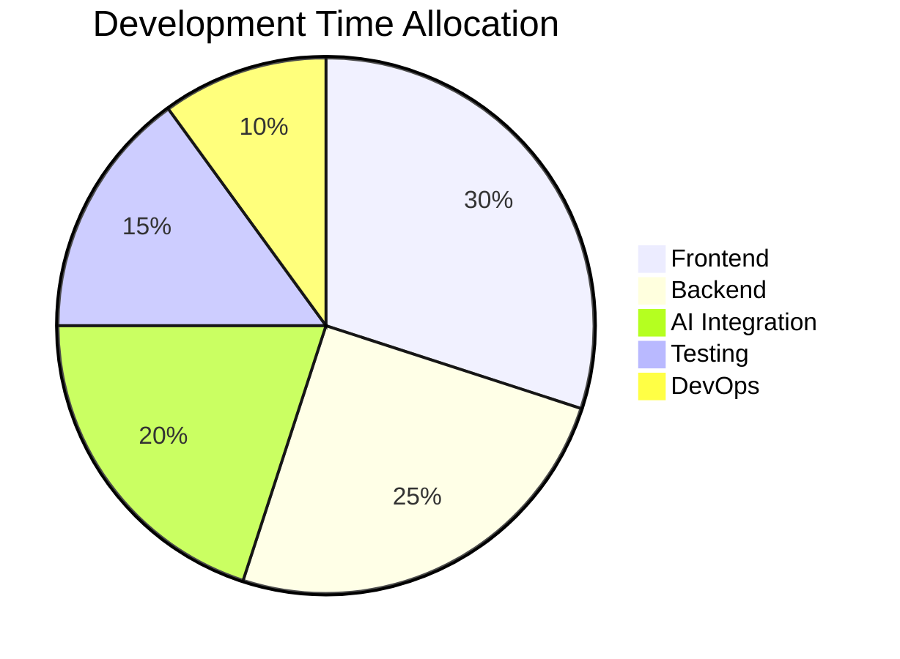
```mermaid
pie title Development Time Allocation
    "Frontend" : 30
    "Backend" : 25
    "AI Integration" : 20
    "Testing" : 15
    "DevOps" : 10
```

**Use Cases**: Budget allocation, time tracking, market share analysis, performance metrics

### 9. Quadrant Chart - Decision Matrix

Ideal for strategic analysis and prioritization frameworks:

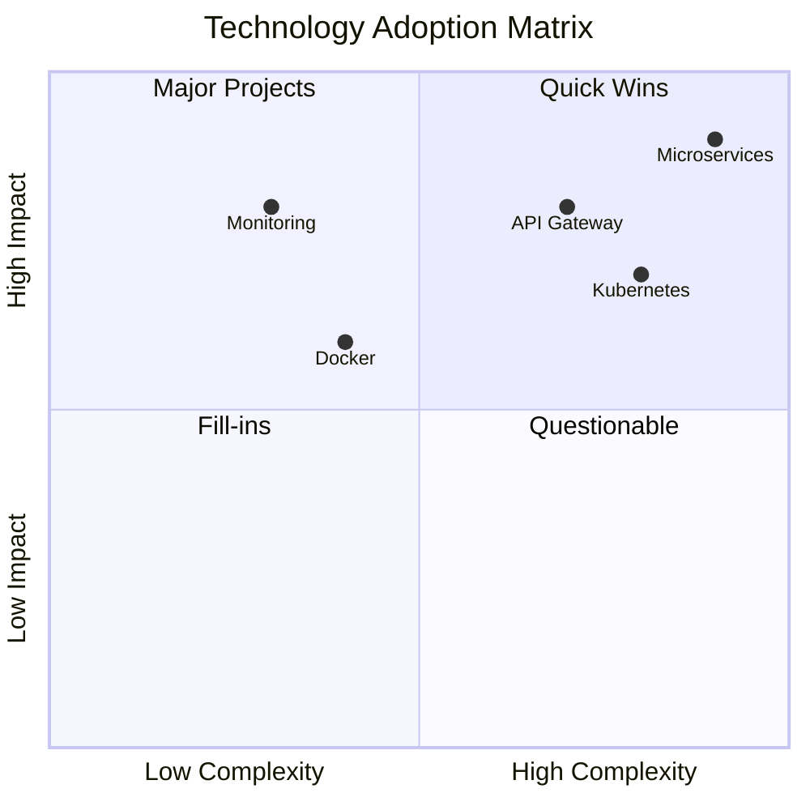
```mermaid
quadrantChart
    title Technology Adoption Matrix
    x-axis Low Complexity --> High Complexity
    y-axis Low Impact --> High Impact
    quadrant-1 Quick Wins
    quadrant-2 Major Projects
    quadrant-3 Fill-ins
    quadrant-4 Questionable
    
    API Gateway: [0.7, 0.8]
    Microservices: [0.9, 0.9]
    Docker: [0.4, 0.6]
    Kubernetes: [0.8, 0.7]
    Monitoring: [0.3, 0.8]
```

**Use Cases**: Technology adoption, feature prioritization, risk assessment, strategic planning

### 10. Requirement Diagram - Specification Modeling

Essential for documenting requirements and verification methods:

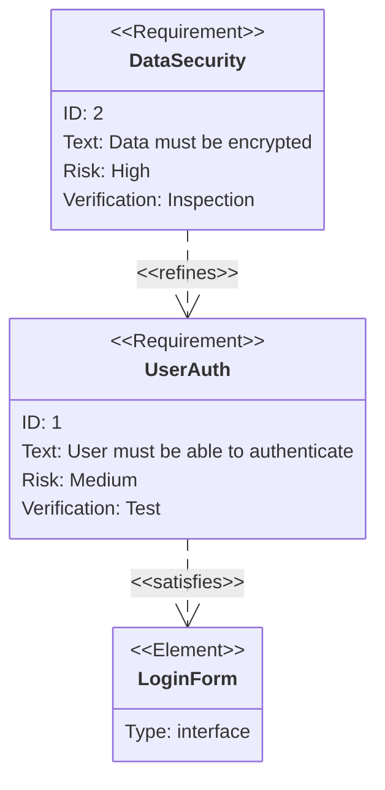
```mermaid
requirementDiagram
    requirement UserAuth {
        id: 1
        text: User must be able to authenticate
        risk: medium
        verifymethod: test
    }
    
    requirement DataSecurity {
        id: 2
        text: Data must be encrypted
        risk: high
        verifymethod: inspection
    }
    
    element LoginForm {
        type: interface
    }
    
    UserAuth - satisfies -> LoginForm
    DataSecurity - refines -> UserAuth
```

**Use Cases**: Requirements engineering, compliance documentation, testing strategy, system specifications

### 11. Git Graph - Version Control Visualization

Perfect for documenting branching strategies and release workflows:

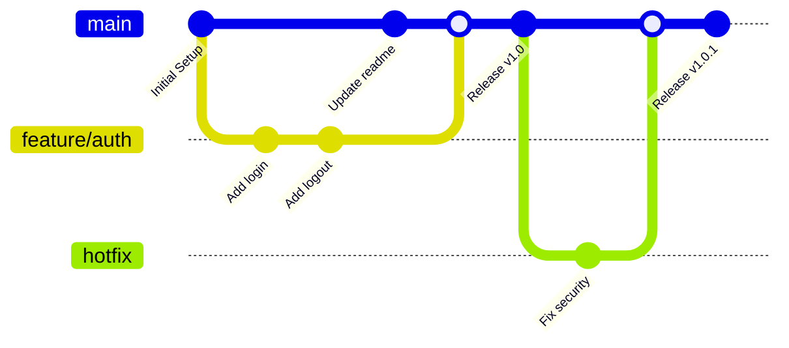
```mermaid
gitGraph
    commit id: "Initial Setup"
    branch feature/auth
    checkout feature/auth
    commit id: "Add login"
    commit id: "Add logout"
    checkout main
    commit id: "Update readme"
    merge feature/auth
    commit id: "Release v1.0"
    branch hotfix
    checkout hotfix
    commit id: "Fix security"
    checkout main
    merge hotfix
    commit id: "Release v1.0.1"
```

**Use Cases**: Git workflow documentation, release planning, branching strategy, deployment pipelines

### 12. Mindmap - Concept Organization

Excellent for brainstorming sessions and knowledge organization:

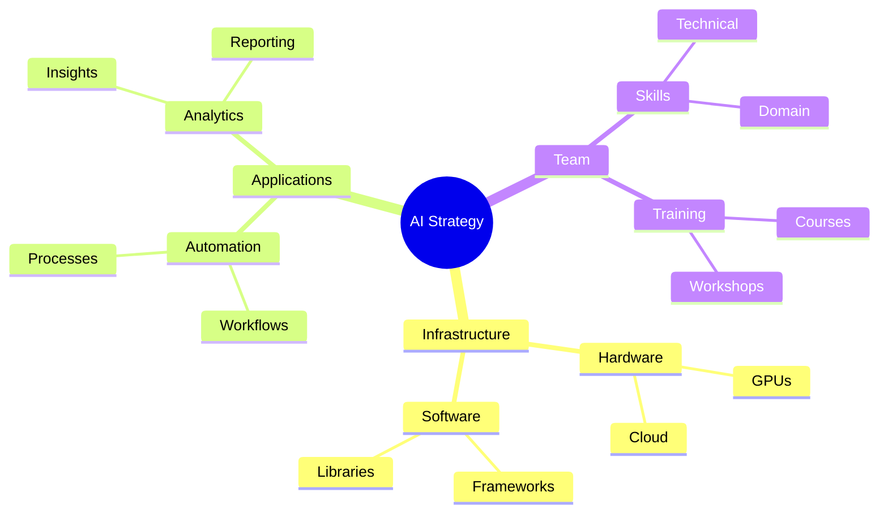
```mermaid
mindmap
  root((AI Strategy))
    Infrastructure
      Hardware
        GPUs
        Cloud
      Software
        Frameworks
        Libraries
    Applications
      Automation
        Workflows
        Processes
      Analytics
        Insights
        Reporting
    Team
      Skills
        Technical
        Domain
      Training
        Courses
        Workshops
```

**Use Cases**: Brainstorming, knowledge mapping, strategic planning, learning pathways

### 13. Timeline - Event Chronology

Perfect for documenting historical events and future planning:

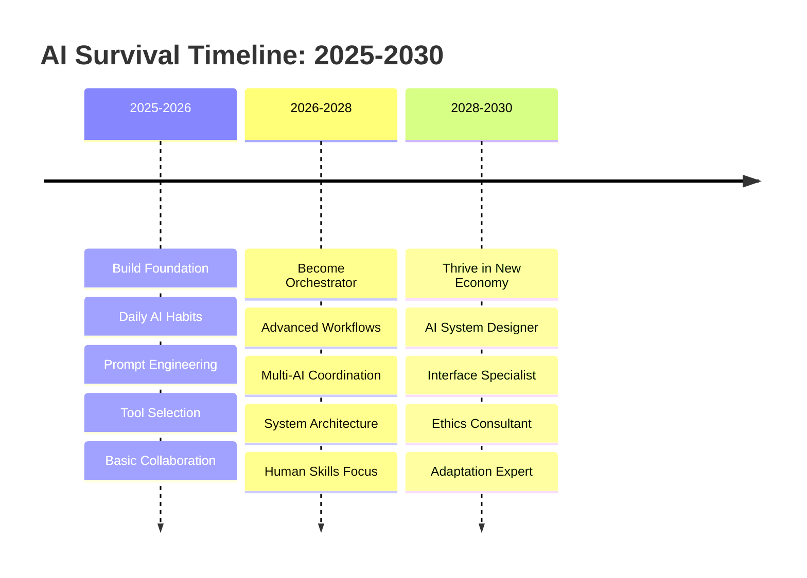
```mermaid
timeline
    title AI Survival Timeline: 2025-2030
    
    2025-2026 : Build Foundation
              : Daily AI Habits
              : Prompt Engineering
              : Tool Selection
              : Basic Collaboration
    
    2026-2028 : Become Orchestrator
              : Advanced Workflows
              : Multi-AI Coordination
              : System Architecture
              : Human Skills Focus
    
    2028-2030 : Thrive in New Economy
              : AI System Designer
              : Interface Specialist
              : Ethics Consultant
              : Adaptation Expert
```

**Use Cases**: Roadmap planning, historical documentation, milestone tracking, evolution timelines

### 14. Sankey Diagram - Flow Visualization

Ideal for showing flow and distribution patterns:

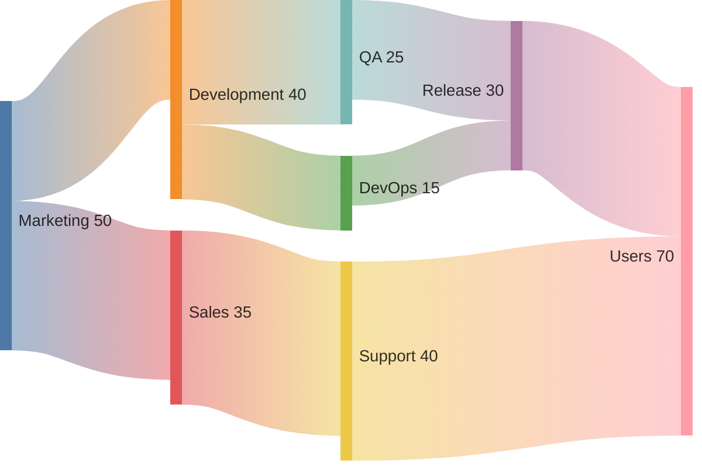
```mermaid
sankey-beta
    Marketing,Development,20
    Marketing,Sales,30
    Development,QA,25
    Development,DevOps,15
    Sales,Support,35
    QA,Release,20
    DevOps,Release,10
    Support,Users,40
    Release,Users,30
```

**Use Cases**: Resource flow analysis, conversion funnel visualization, energy/cost distribution, process optimization

### 15. XY Chart - Data Trends

Essential for displaying quantitative data and trends:

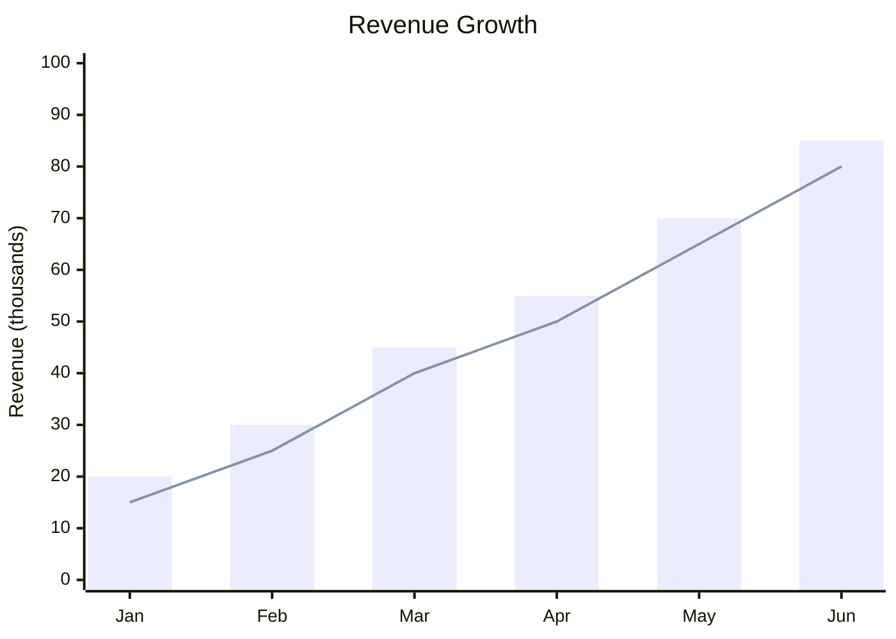
```mermaid
xychart-beta
    title "Revenue Growth"
    x-axis [Jan, Feb, Mar, Apr, May, Jun]
    y-axis "Revenue (thousands)" 0 --> 100
    bar [20, 30, 45, 55, 70, 85]
    line [15, 25, 40, 50, 65, 80]
```

**Use Cases**: Performance metrics, trend analysis, financial reporting, KPI dashboards

### 16. Graph - Network Relationships

Perfect for complex system relationships and network topologies:

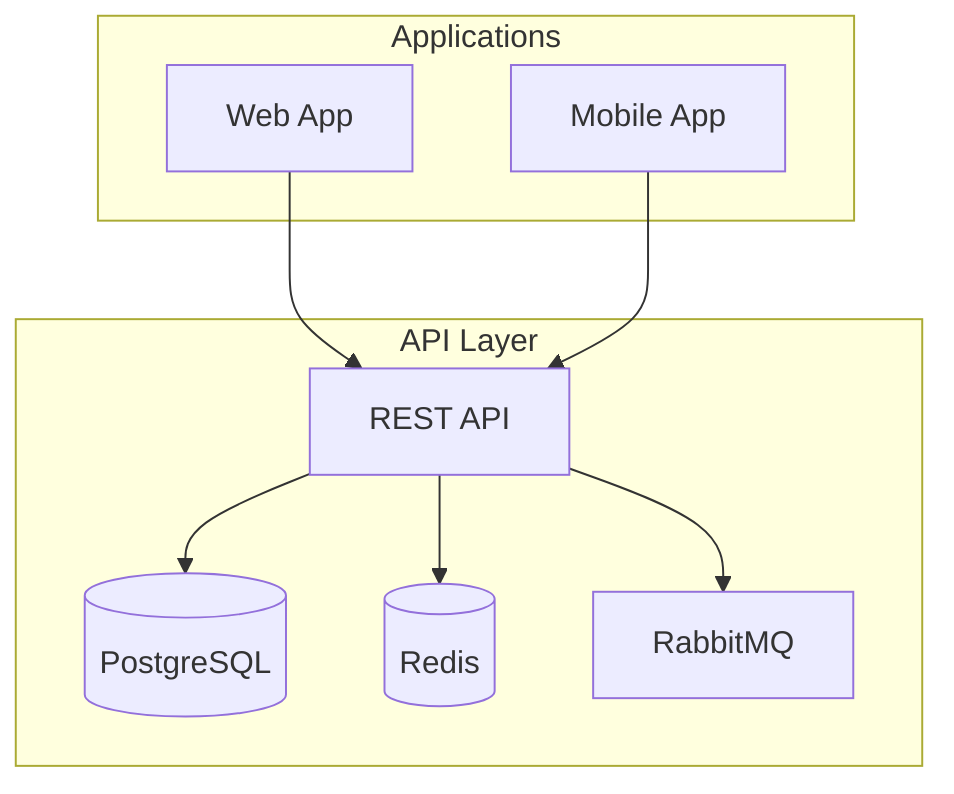
```mermaid
graph TB
    subgraph "API Layer"
        API[REST API]
        DB[(PostgreSQL)]
        CACHE[(Redis)]
        QUEUE[RabbitMQ]
    end
    
    subgraph "Applications"
        WEB[Web App]
        MOBILE[Mobile App]
    end
    
    WEB --> API
    MOBILE --> API
    API --> DB
    API --> CACHE
    API --> QUEUE
```

**Use Cases**: System architecture, network topology, dependency mapping, infrastructure documentation

### 17. Radar Chart - Multi-dimensional Comparison

Excellent for comparing multiple attributes across different categories:

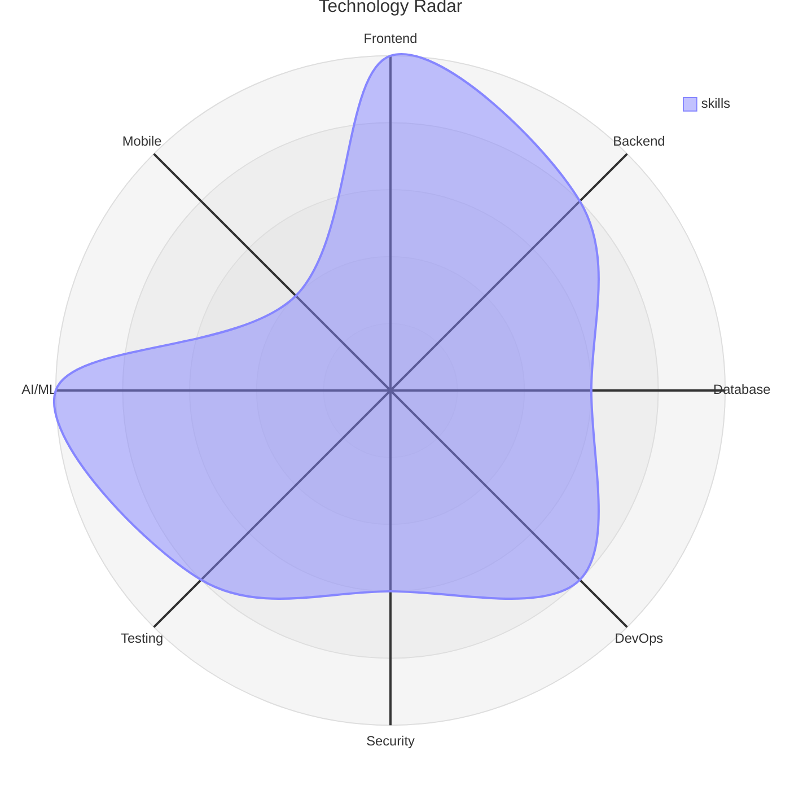
```mermaid
radar-beta
    title Technology Radar
    axis frontend["Frontend"], backend["Backend"], database["Database"], devops["DevOps"]
    axis security["Security"], testing["Testing"], aiml["AI/ML"], mobile["Mobile"]
    curve skills{5, 4, 3, 4, 3, 4, 5, 2}
```

**Use Cases**: Skill assessment, technology evaluation, performance benchmarking, competitive analysis

## Technical Implementation Details

### Theme Integration

Our Mermaid implementation uses a custom theme that integrates seamlessly with the GitHub Dark design system:

```javascript
const themeConfig = {
  primaryColor: '#3b82f6',        // Blue primary
  secondaryColor: '#7c3aed',      // Purple accents
  background: '#0d1117',          // GitHub dark background
  primaryTextColor: '#f0f6fc',    // GitHub text primary
  lineColor: '#30363d'            // GitHub border default
}
```

### Error Handling and Fallbacks

Each diagram includes robust error handling with graceful fallbacks:

- Syntax validation before rendering
- Unique ID generation to prevent conflicts
- Fallback code display for failed renders
- Detailed error messages for debugging

### Responsive Design

Diagrams automatically scale across device sizes with configurable size variants:

- **Small**: Optimized for mobile viewing
- **Medium**: Standard desktop display
- **Large**: Detailed presentation mode
- **Auto**: Dynamic sizing based on content

## Best Practices and Recommendations

### 1. Syntax Validation
Always validate diagram syntax before deployment. Common issues include:
- Incorrect relationship syntax in ER diagrams
- Missing semicolons in class definitions
- Invalid date formats in Gantt charts

### 2. Performance Considerations
- Use client-side rendering to prevent hydration issues
- Implement lazy loading for diagram-heavy pages
- Cache rendered SVG output when possible

### 3. Accessibility
- Provide alternative text descriptions
- Ensure sufficient color contrast
- Support keyboard navigation where applicable

### 4. Content Strategy
- Use consistent terminology across diagrams
- Maintain diagram simplicity for readability
- Regular updates to keep documentation current

## Conclusion

Mermaid diagrams provide a powerful solution for visual documentation in modern web applications. Our implementation demonstrates how to integrate these tools with custom theming, proper error handling, and responsive design patterns.

The combination of 15+ diagram types with GitHub Dark theming creates a professional documentation experience that scales from simple flowcharts to complex system architectures. This approach enables teams to create maintainable, version-controlled visual documentation that evolves with their codebase.

Whether documenting API flows, database schemas, or user journeys, Mermaid diagrams offer a code-first approach to visual communication that fits naturally into modern development workflows.